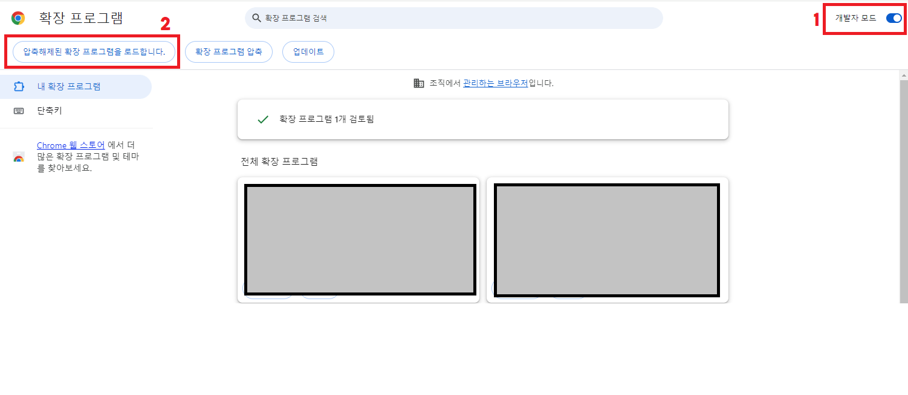
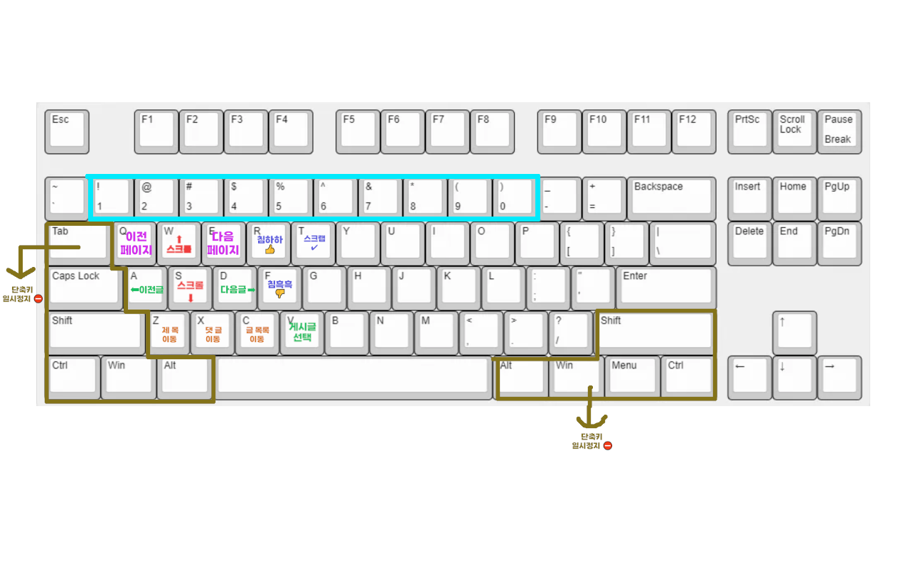

1. 프로그램 개요

    침하하 이용 시 키보드로 쉽게 조작하기 위해서 개발
    * 원래 계획은 크롬 확장 프로그램에 올리려고 했으나  
    개인정보 포털에서 개인정보처리방침 만들기가 법 개정으로 일시적 서비스 중단 한다고해서 대기 중...

2. 프로그램 설치방법

    1. https://github.com/JeonJeongWook/Chim_Utility 접속 후 순서대로 클릭
    

    2. 설치받은 zip파일을 원하는 폴더에 압축풀기

    3. 주소창에 chrome://extensions/ 적은 후 엔터  
    (보통 설치받은 확장 프로그램들이 있음)

    4. [개발자 모드 on] - [압축해제된 확장 프로그램을 로드합니다.]  
    -> 2번에서 압축풀은 경로로 이동 후 [Chim_Utility-main] 폴더 선택
    

    4. 해당 그림처럼 침착맨 로고가 나오면 설치 성공!
    

3. 프로그램 사용법

    

    * 화면 스크롤  
        W - 위로  
        S - 아래로  

    * 게시물 이동  
        A - 이전글  
        D - 다음글  

    * 화면이동 바로가기 키  
        Z - 게시글 제목으로 이동  
        X - 댓글창으로 이동  
        C - 글 목록으로 이동  

    * 버튼 기능  
        R - 침하하 버튼 클릭  
        F - 침흑흑 버튼 클릭  
        T - 스크랩 버튼 클릭  
        * 해당 기능은 잘못 눌렀을 경우를 대비하여 다시한번 물어봅니다.